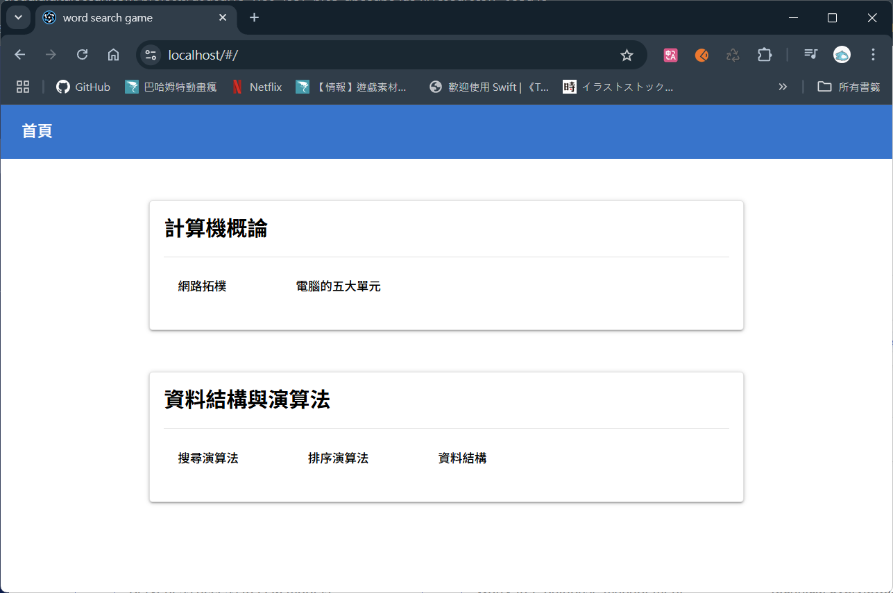
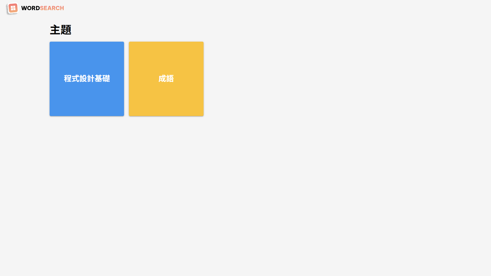
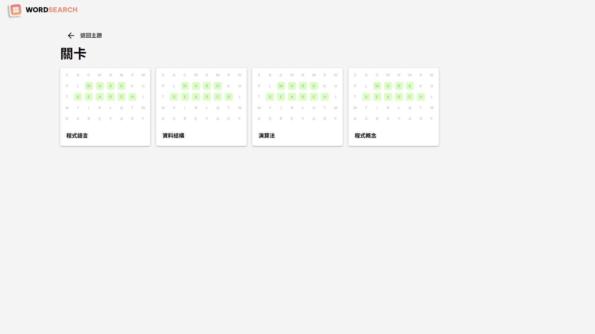
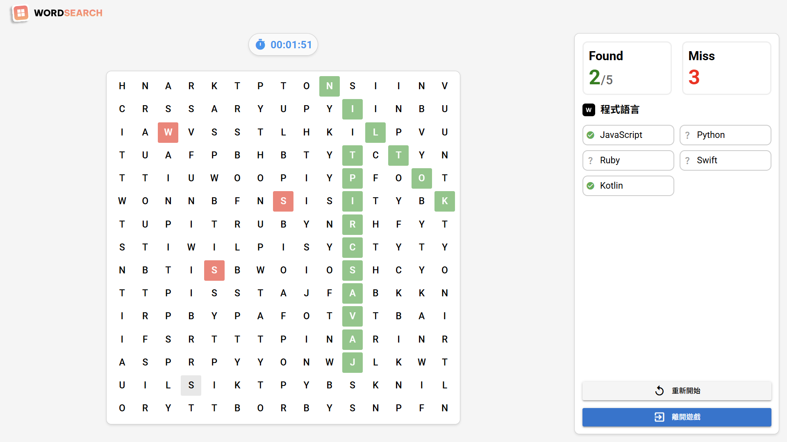
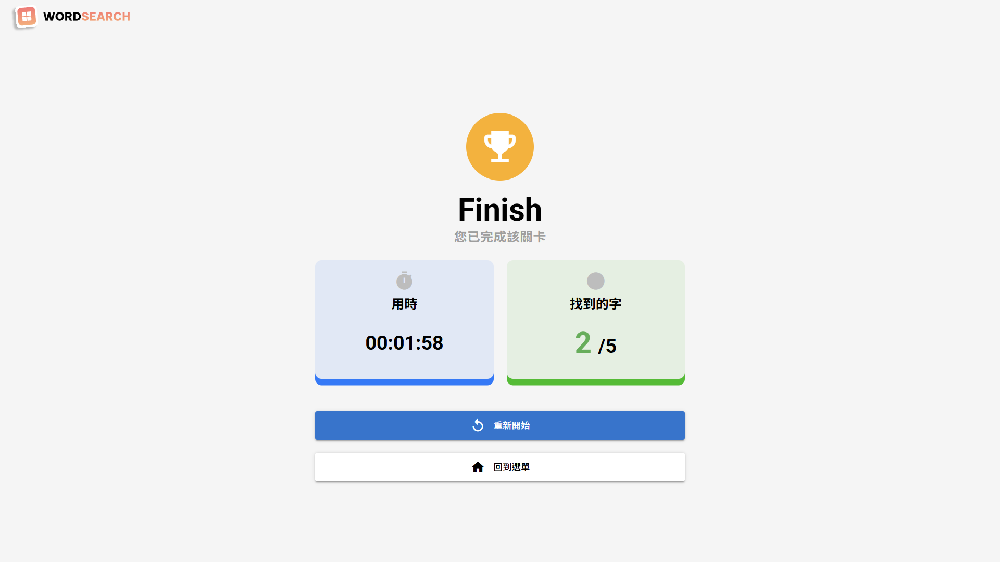

# Word Search Game

這是一個文字搜尋遊戲的專案，玩家需要在矩陣中找到所有指定的單詞。

## 功能

- **支援中文**: 支援中文詞語搜尋
- **多方向搜尋**: 支援橫向、縱向、斜向搜尋
- **句子標示**: 網格內標示已找到的詞語及錯誤詞
- **多操作裝置**: 支援電腦與手機操作 (RWD)

## 專案架構

- **前端框架**: Quasar
- **後端框架**: Node.js + Express
- **資料庫**: MySQL
- **容器化**: Docker

## 實機畫面










## 啟動專案

### 前置準備

#### 建立 `dev.env` 檔案
根據專案資料夾內的 `.env.example` 檔案，分別在 `compose` 和 `server` 資料夾中建立一個名為 `dev.env` 的檔案，並根據實際需求修改環境變數的值。

### 使用 Docker Compose 啟動

#### 安裝 Docker 和 Docker Compose
確保已安裝 [Docker](https://www.docker.com/) 和 [Docker Compose](https://docs.docker.com/compose/)。

#### 1. 打包前端
進入 `web` 資料夾，執行以下指令進行打包：
```bash
cd web
quasar build
```


#### 2. 啟動 MySQL 並引入資料
在專案 `compose` 目錄下執行以下指令及步驟以啟動服務：

1. 啟動 mysql container
    ```bash
    docker-compose --env-file dev.env -f compose.dev.yml up -d mysql
    ```

2. 將 `wsgame.sql` 匯入到 `wordsearchgame` 資料庫


#### 3. 啟動服務
在專案 `compose` 目錄下執行以下指令以啟動服務：
```bash
docker-compose --env-file dev.env -f compose.dev.env up -d
```

#### 4. 開啟瀏覽器
在瀏覽器中開啟以下網址以查看專案：
```
http://localhost:your_port
```
### 手動方式啟動

#### 1. 啟動 MySQL
確保已安裝並啟動 MySQL，並且已在wordsearchgame庫引入wsgame.sql。

#### 2. 啟動後端伺服器

#### 確保已安裝 Node.js
請先安裝 [Node.js](https://nodejs.org/)，以確保可以執行後端伺服器程式。

進入 `server` 資料夾，安裝依賴套件並啟動伺服器：
```bash
cd server
npm install
node server
```

#### 3. 啟動前端應用程式 (Quasar)
進入 `web` 資料夾，安裝依賴並啟動開發伺服器：
```bash
cd web
npm install
quasar dev
```

#### 4. 開啟瀏覽器
在瀏覽器中開啟以下網址以查看專案：
```
http://localhost:9000
```

## 資料夾結構

```
📂 wordsearchgame
├── 📂 compose                         # Docker Compose 配置檔案
│   ├── 📄 .env.example                # 環境變數範例檔案
│   ├── 📄 compose.dev.yml             
│   └── 📄 compose.prod.yml            
├── 📂 server
│   ├── 📂 src
│   │   ├── 📂 configs                           
│   │   │   └── 📄 mysqlPool.js                  # Mysql 連線設定
│   │   ├── 📂 controllers                       
│   │   │   └── 📄 game.controller.js            # 遊戲控制器
│   │   ├── 📂 middleware                        
│   │   │   └── 📄 errorHandl.js                 # 錯誤狀態處理
│   │   ├── 📂 models                            
│   │   │   └── 📄 game.model.js                 # 遊戲資料存取
│   │   ├── 📂 routers                           
│   │   │   ├── 📄 game.router.js                # 遊戲相關 API
│   │   │   └── 📄 main.js                       # API 主路由
│   │   ├── 📂 services                          
│   │   │   └── 📄 game.service.js               # 遊戲業務邏輯
│   │   └── 📄 server.js                         # 後端主程式
│   ├── 📄 .env.example                          # 環境變數範例檔案
│   ├── 📄 Dockerfile                  
│   ├── 📄 package.json                
│   └── 📄 package-lock.json           
├── 📂 web                                       # 前端程式碼
│   ├── 📂 nginx      
│   │   └── 📄 nginx.conf                        # Nginx設定檔
│   ├── 📂 public                      
│   ├── 📂 src
│   │   ├── 📂 api
│   │   │   └── 📄 GameService.js                # 遊戲相關 API 服務
│   │   ├── 📂 assets                  
│   │   ├── 📂 boot                    
│   │   ├── 📂 components
│   │   │   ├── 📄 GameGrid.vue                  # 遊戲網格元件
│   │   │   └── 📄 GameInfoPanel.vue             # 遊戲中狀態資訊元件
│   │   ├── 📂 css                     
│   │   ├── 📂 layouts                           # 頁面佈局
│   │   │   ├── 📄 EmptyLayout.vue               # 空白布局
│   │   │   └── 📄 MainLayout.vue                # 主要布局 ( Header + Main )
│   │   ├── 📂 pages
│   │   │   ├── 📂 GamePages                     # 頁面組件
│   │   │   │   ├── 📄 GameFinishPage.vue        # 遊戲結束頁面
│   │   │   │   ├── 📄 GamePlayingPage.vue       # 遊戲進行中頁面
│   │   │   │   └── 📄 IndexPage.vue             # 遊戲主控制頁面
│   │   │   ├── 📄 ErrorNotFound.vue             # 404 錯誤頁面(預設)
│   │   │   ├── 📄 IndexPage.vue                 # 遊戲首頁
│   │   │   ├── 📄 LevelsPage.vue                # 遊戲關卡列表頁面
│   │   │   └── 📄 SubjectPage.vue               # 遊戲主題列表頁面
│   │   ├── 📂 router                            # 路由設定
│   │   ├── 📂 stores
│   │   │   └── 📄 GameStore.vue                 # 遊戲狀態管理
│   │   └── 📄 main.js
│   ├── 📂 node_modules
│   ├── 📂 .quasar
│   ├── 📂 .vscode
│   ├── 📄 dockerfile                            # Nginx 容器設定
│   ├── 📄 package.json
│   ├── 📄 package-lock.json
│   ├── 📄 quasar.config.js
│   ├── 📄 postcss.config.cjs
│   ├── 📄 jsconfig.json
│   └── 📄 App.vue
├── 📄 wsgame.sql
├── 📄 .gitignore
└── 📄 README.md
```
