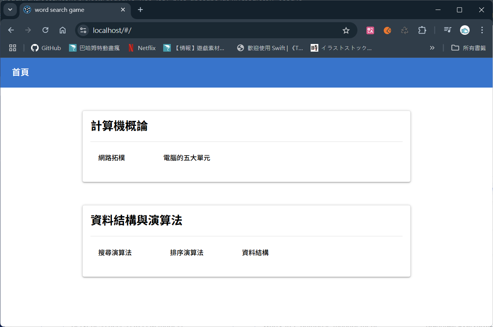
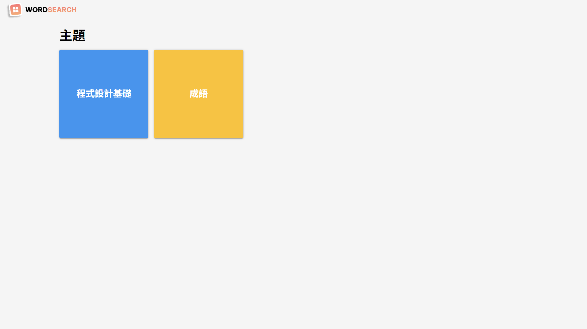
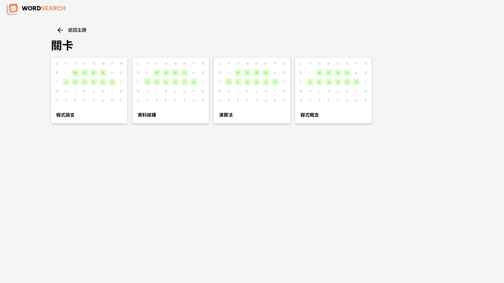

# Word Search Game

這是一個文字搜尋遊戲的專案，玩家需要在矩陣中找到所有指定的單詞。

## 功能

- **支援中文**: 支援中文詞語搜尋
- **多方向搜尋**: 支援橫向、縱向、斜向搜尋
- **句子標示**: 網格內標示已找到的詞語及錯誤詞
- **多操作裝置**: 支援電腦與手機操作 (RWD)

## 專案架構

- **前端框架**: Quasar
- **後端框架**: Node.js + Express
- **資料庫**: MySQL
- **容器化**: Docker

## 實機畫面






## 啟動專案

### ⚙️ 前置準備

#### 📝 建立 `dev.env` 檔案
根據專案資料夾內的 `.env.example` 檔案，分別在 `compose` 和 `server` 資料夾中建立一個名為 `dev.env` 的檔案，並根據實際需求修改環境變數的值。

### 🚀 使用 Docker Compose 啟動

#### 🛠️ 安裝 Docker 和 Docker Compose
確保已安裝 [Docker](https://www.docker.com/) 和 [Docker Compose](https://docs.docker.com/compose/)。

#### ▶️ 1. 打包前端
進入 `web` 資料夾，執行以下指令進行打包：
```bash
cd web
quasar build
```


#### ▶️ 2. 啟動 MySQL 並引入資料
在專案 `compose` 目錄下執行以下指令及步驟以啟動服務：

1. 啟動 mysql container
    ```bash
    docker-compose --env-file dev.env -f compose.dev.yml up -d mysql
    ```

2. 將 `wsgame.sql` 匯入到 `wordsearchgame` 資料庫


#### ▶️ 3. 啟動服務
在專案 `compose` 目錄下執行以下指令以啟動服務：
```bash
docker-compose --env-file dev.env -f compose.dev.env up -d
```

#### 🌐 4. 開啟瀏覽器
在瀏覽器中開啟以下網址以查看專案：
```
http://localhost:your_port
```
### 🚀 手動方式啟動

#### ▶️ 1. 啟動 MySQL
確保已安裝並啟動 MySQL，並且已在wordsearchgame庫引入wsgame.sql。

#### ▶️ 2. 啟動後端伺服器

#### ⚙️ 確保已安裝 Node.js
請先安裝 [Node.js](https://nodejs.org/)，以確保可以執行後端伺服器程式。

進入 `server` 資料夾，安裝依賴套件並啟動伺服器：
```bash
cd server
npm install
node server
```

#### ▶️ 3. 啟動前端應用程式 (Quasar)
進入 `web` 資料夾，安裝依賴並啟動開發伺服器：
```bash
cd web
npm install
quasar dev
```

#### 🌐 4. 開啟瀏覽器
在瀏覽器中開啟以下網址以查看專案：
```
http://localhost:9000
```

## 📂 資料夾結構

```
📂 wordsearchgame
├── 📂 compose                         # Docker Compose 配置檔案
│   ├── 📂 conf      
│   │   └── 📄 nginx.conf              # Nginx設定檔
│   ├── 📄 .env.example                # 環境變數範例檔案
│   ├── 📄 compose.dev.yml             
│   └── 📄 compose.prod.yml            
├── 📂 server                          # 後端程式碼
│   ├── 📂 services                    # 服務邏輯目錄
│   │   ├── 📂 api                     # API 路由處理
│   │   │   ├── 📂 game                # 遊戲相關 API
│   │   │   └── 📄 main.js             # API 主路由
│   │   ├── 📂 db                      # 資料庫操作
│   │   │   ├── 📄 dbPool.js           # 資料庫連線池
│   │   │   └── 📄 wsgame.js           # 遊戲資料資料庫處理
│   ├── 📄 .env.example                # 環境變數範例檔案
│   ├── 📄 Dockerfile                  
│   ├── 📄 package.json                
│   ├── 📄 package-lock.json           
│   └── 📄 server.js                   # 後端主程式
├── 📂 web                             # 前端程式碼
│   ├── 📂 public                      
│   ├── 📂 src
│   │   ├── 📂 api                     # 前端 API 服務
│   │   │   └── 📄 GameService.js      # 遊戲相關 API 服務
│   │   ├── 📂 assets                  
│   │   ├── 📂 boot                    
│   │   ├── 📂 components
│   │   │   ├── 📄 Nav.vue             # 導覽列元件
│   │   │   └── 📄 WordSearch.vue      # 文字搜尋遊戲元件
│   │   ├── 📂 css                     
│   │   ├── 📂 layouts                 # 頁面佈局
│   │   ├── 📂 pages                   # 頁面組件
│   │   │   ├── 📄 ErrorNotFound.vue   # 404 錯誤頁面(預設)
│   │   │   ├── 📄 GameListPage.vue    # 遊戲列表頁面
│   │   │   └── 📄 GamePage.vue        # 遊戲頁面
│   │   ├── 📂 router                  # 路由設定
│   │   ├── 📂 stores                  # 狀態管理(Pinia)
│   │   └── 📄 main.js                 # 前端主程式入口
│   ├── 📂 node_modules
│   ├── 📂 .quasar
│   ├── 📂 .vscode
│   ├── 📄 package.json
│   ├── 📄 package-lock.json
│   ├── 📄 quasar.config.js            # Quasar 框架配置檔
│   ├── 📄 postcss.config.cjs
│   ├── 📄 jsconfig.json
│   └── 📄 App.vue                     # Vue 主應用程式
├── 📄 wsgame.sql
├── 📄 .gitignore
└── 📄 README.md
```
